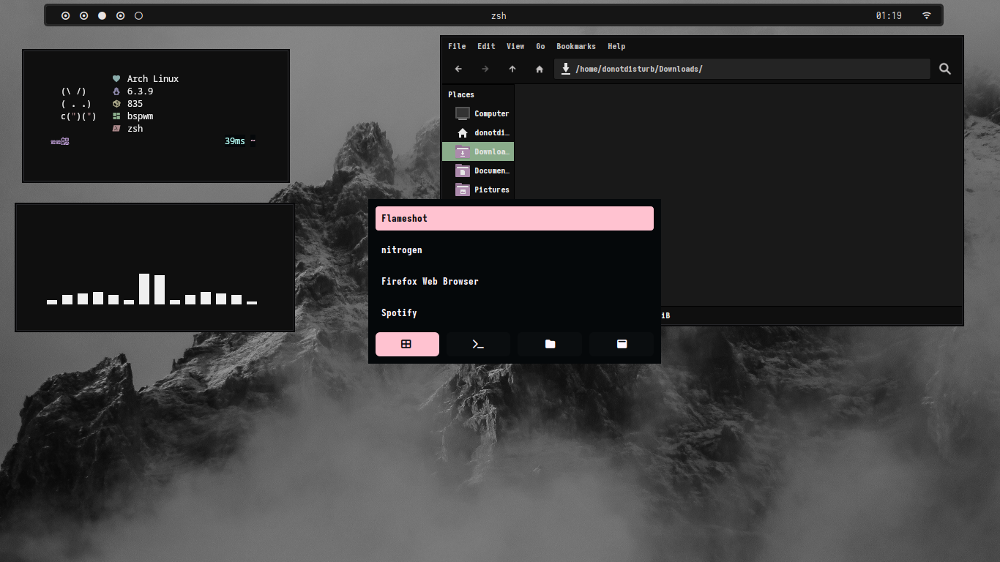

# dotfiles
<h2 align="center"> 
 <samp> dotfiles  </samp>
</h2>

  

  

## <samp> .info </samp>
- **Operating System:** [Arch Linux](https://archlinux.org/)
- **Window Manager:** [bspwm](https://github.com/baskerville/bspwm)
- **Terminal:** [kitty](https://sw.kovidgoyal.net/kitty/)
- **Shell:** [zsh](https://www.zsh.org/) + Starship (https://starship.rs/)
- **Panel:** [polybar](https://github.com/polybar/polybar)
- **Application Launcher:** [rofi](https://github.com/davatorium/rofi)

